# Retrieved Context and Deficient Processing
Toward a Composite Account of Spacing and Repetition Effects in Free Recall

## How do people process and remember repeated experience?
Used dataset from Lohnas and Kahana (2014) with subjects recalling
1. **Control lists** that contained all once-presented items
2. **Pure massed lists** containing all twice-presented items
3. **Pure spaced lists** consisting of items presented twice at lags 1-8
4. **Mixed lists** consisting of once presented, massed and spaced items. Within each session, subjects encountered three lists of each of these four types. 

## Retrieved Context Theory
1. Studied items are associated with an gradually changing, recency-weighted representation of temporal context
2. The contexts retrieved from studying or recalling items in turn update the current state of context 
3. The current state of context is used as the cue for each item recall
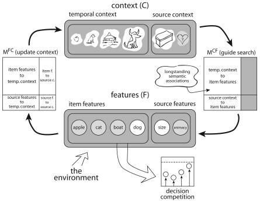

### CMR Accounts for Many Spacing and Repetition Effects (Lohnas and Kahana, 2014)
- **Contextual Variability**. More distinct study contexts across item presentations **->** diverse potential recall cues
- **Study-phase retrieval**. Retrieval of prior study contexts upon item repetition **->** Items across distinct contexts get associated
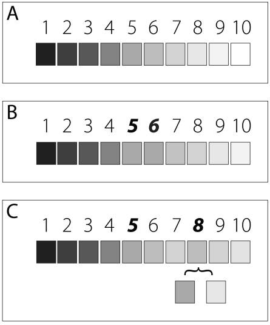

### CMR Accounts for The Spacing Effect
the probability of recalling repeatedly presented items increases with the number of items intervening between presentations.

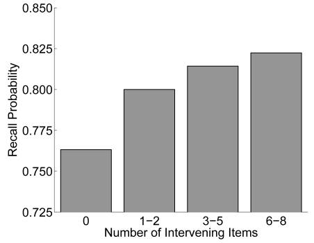

### CMR Accounts for the OR-Score Effect
the probability of recalling one item or the other (OR score) also increases with the number of items intervening between their presentations.

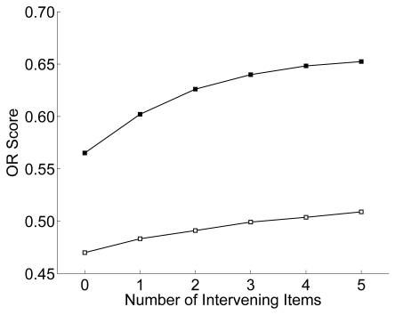

### CMR Accounts for Higher Rates of Transition Between Neighbors of Repeated Items, Too
If an item gets presented at positions i and j, transitions in recall from `{i + 1, i + 2}` to  `{j + 1, j + 2}` are more likely -- and vice versa.

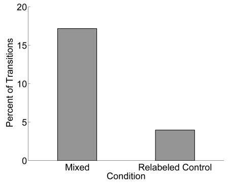

### Main Gaps in Initial CMR Analysis
- No model fitting, so comparison against behavioral data was mainly qualitative
- "Although we found that retrieved context theory can account for the set of repetition effects reported here, other mechanisms may contribute as well."

## Deficient-Processing Theory
1. Short-term item familiarity impairs attention and memory of subsequent encoding.
2. Repeated experience of an item increases familiarity with that item
3. Familiarity decreases with intervening experience, allowing better memory of repetitions

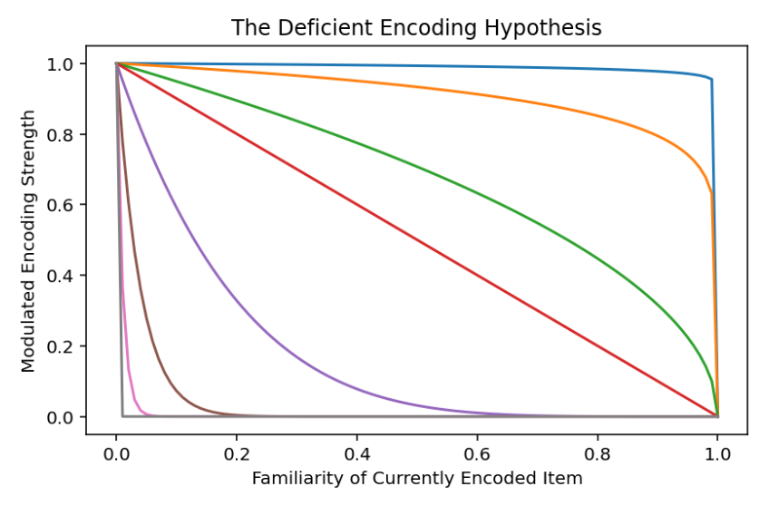

### Deriving Predictions From Deficient-Processing Theory + RCT
As a reminder, RCT predicts:
1. Studied items are associated with an gradually changing, recency-weighted representation of temporal context
2. The contexts retrieved from studying or recalling items in turn update the current state of context 
3. The current state of context is used as the cue for each item recall

...So deficient processing of an item's second presentation should correspond with an **attenuated lag-recency effect** relative to the item's second presentation compared to its first.

### Specializing the Lag-CRP Analysis
For recalls for repeated items with spacing >= 4, track relative to their first and second study positions:
1. For lags `[-2, -1, 1, 2]` if transition to recall with lag is possible
2. For lags `[-2, -1, 1, 2]` if transition to recall with lag actually happened
   
**Actual Count / Possible Count = Conditional Recall Probability by Lag**
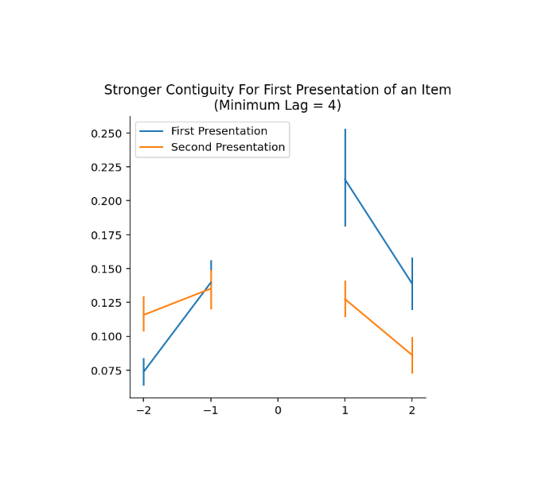

### Just for Repeated items with Spacing >= 6
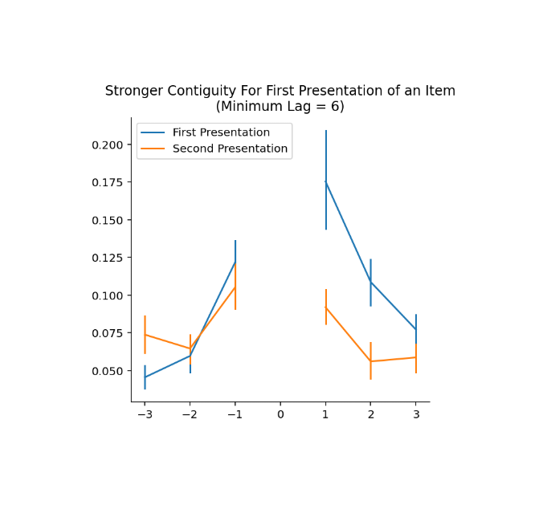

### Just for Repeated items with Spacing >= 8
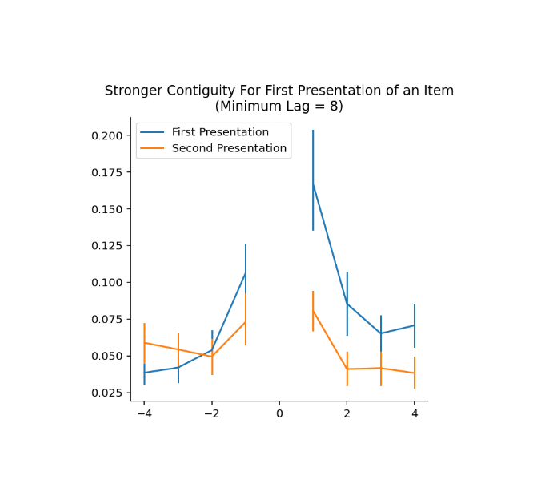

## Could Serial Position Effects Explain This Difference?
Perform the same analysis to the same *study positions* but to 1000 shufflings of the control list trials (no repetitions)

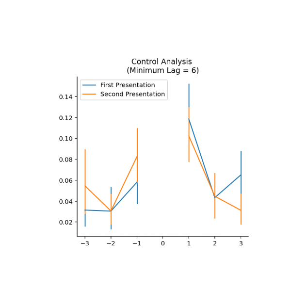

## Does CMR Account for This Difference?
Fit CMR to mixed trials, simulate performance across trials, plot result.

Nope!

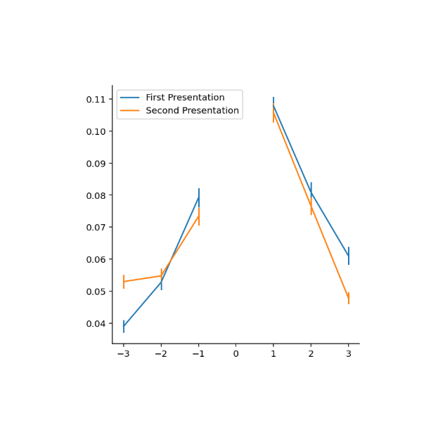

## Forward Variant (in Development)
We determine the proportion of times, given that a subject recalled an item presented before a repeated item's first presentation ($S_i = {i-2, i-1}$) or its second presentation ($S_j = {j-2, j-1}$),

that they then transition to recall the item presented at ${i, j}$.

The transition occurred about 4x more often from $S_i$ than from $S_j$! 

In my control analysis (same serial positions, no repetitions), this was about 1.25x.

## Modeling Approach: Toward a CMR-DE

## What is the function of familiarity with attention to and/or memory of encoded items?
We try:
$$
\zeta_i = Distance(c_i, f_i)^{\zeta_s}
$$
- Decreases monotonically with cosine distance between item and context
- Flexible but always neutral for novel items
- Configured by one parameter, $\zeta_s$

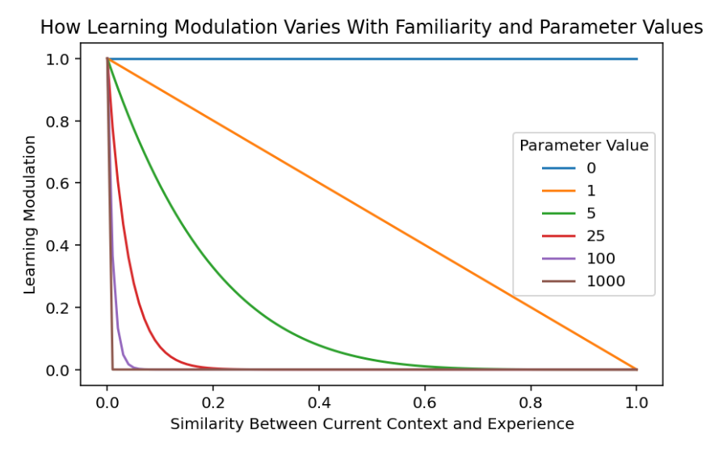

## What operations in CMR model simulation should be modulated by familiarity?
We consider attenuating:
- Learning rate of context-to-feature associations, $M^{CF}$. Primarily attenuates memory strength of repeated items based on spacing.
- Learning rate of feature-to-context associations, $M^{FC}$. Primarily attenuates rate of negative transitions from second presentation position in recall.
- Amount of associated context retrieved upon encoding, contextual drift rate, $\beta_{enc}$. Primarily attenuates positive transitions.
- Any/all of the above

## ...But an All of the Above Approach Poorly Fits the Behavioral Effect
Fit to mixed list trials, simulate performance across trials, plot result.
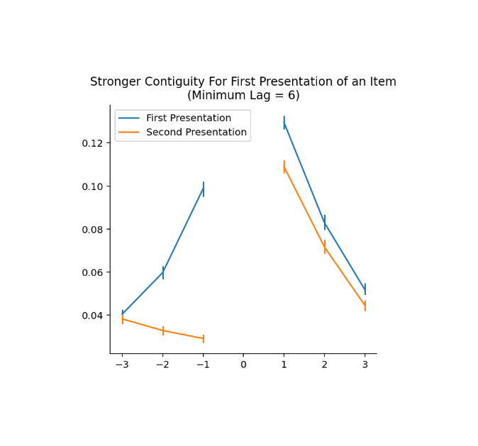

## How do we compare model variants? 
The most common method is to:
1. Fit each model to the entire dataset using a maximimum likelihood criteria 
2. And compare each model's performance with their fitted parameters with a statistical test

...But this approach is post-hoc, and tends toward selection of models with extra parameters since those enable overfitting.

## The Generalization Criterion
The generalization criterion employs samples from two different research designs, thus **distinct from cross-validation**:

1. During a calibration stage, competing models are fit to data from one design. 
2. During a generalization stage, parameters fitted on the first design are used to compute predictive accuracy for the second design.
3. The model with distinguishably better predictive accuracy is selected as the best model.

Because selection is based on the a priori predictions computed from each model, complex and simple models are on equal footing in the generalization stage.

## A Historical Example: CMR Generalization Across List Lengths
Murdock (1962) reports performance as list length is manipulated between trials (20, 30, and 40 items). 

Despite manipulation, CMR fit to one condition can broadly predict performance in others!

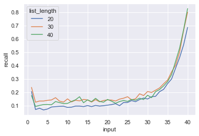

## A Historical Example: CMR Generalization Across List Lengths
Murdock (1962) reports performance as list length is manipulated between trials (20, 30, and 40 items). 

Despite manipulation, CMR fit to one condition can broadly predict performance in others!

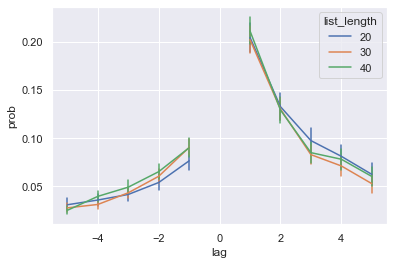

## A Historical Example: CMR Generalization Across List Lengths
Murdock (1962) reports performance as list length is manipulated between trials (20, 30, and 40 items). 

Despite manipulation, CMR fit to one condition can broadly predict performance in others!

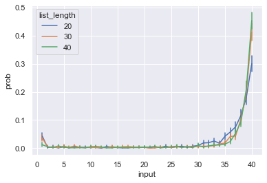

## CMR Generalizes More Poorly From Lists With Repetitions to Control Lists Without
Fit CMR to each condition of Lohnas & Kahana (2014) dataset and simulate performance on control condition.

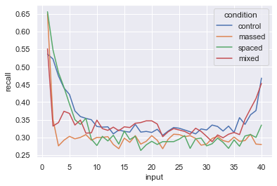

## CMR Generalizes More Poorly From Lists With Repetitions to Control Lists Without
Fit CMR to each condition of Lohnas & Kahana (2014) dataset and simulate performance on control condition.
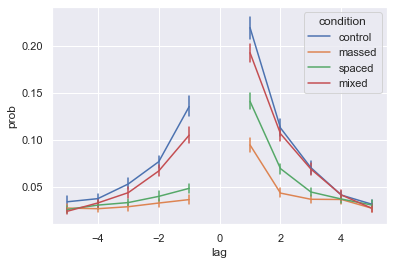

## CMR Generalizes More Poorly From Lists With Repetitions to Control Lists Without
Fit CMR to each condition of Lohnas & Kahana (2014) dataset and simulate performance on control condition.
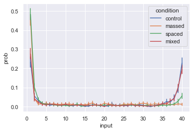

## Messing With Encoding of Second Presentations Might Improve Generalization...
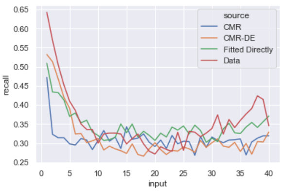

## Messing With Encoding of Second Presentations Might Improve Generalization...
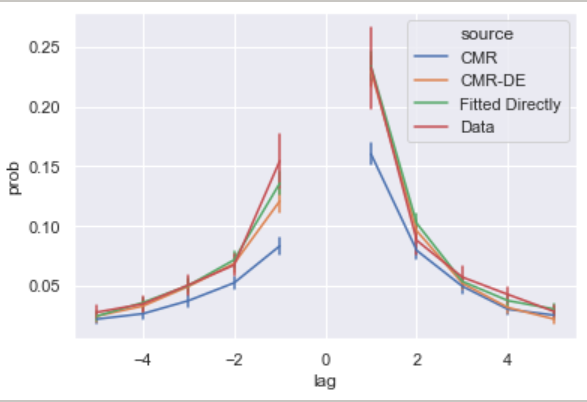

## Messing With Encoding of Second Presentations Might Improve Generalization...
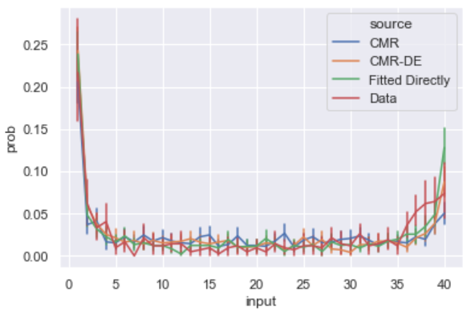

## ...And Account for Our Effect
woops no figure here

Anyway, the right way to do it is still up in the air!